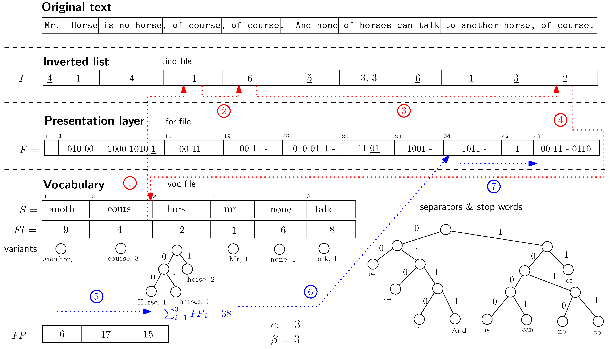

# Fearch - Full-Text Search Engine 



This repository contains Go code to build a full text search engine. The search engine is built using the [Inverted Index](https://en.wikipedia.org/wiki/Inverted_index) data structure. 
The search engine is capable of indexing and searching through a large number of documents. 

When first run, the code indexes the documents and stores the inverted index in a file. The code can then be use that file to search through the documents without the need to re-index the documents every time.

### Instructions:
1. Install Go: Make sure you have Go installed on your system. You can download it [here](https://go.dev/dl/).
2. Clone the Repository:
```bash
git clone https://github.com/bagasdisini/fearch.git
```
3. Navigate to the Directory:
```bash
cd fearch
```
4. Run the Code:
```bash
go run main.go
```
5. Output:
The code will print the search results to the console.

### To Do:
- [ ] Get the documents from ID results.
- [ ] Expand boolean queries to support `OR` and `NOT`.
- [ ] More memory and CPU-efficient when working with large indexes, by using techniques like [MapReduce](https://en.wikipedia.org/wiki/MapReduce) and [Bloom Filters](https://en.wikipedia.org/wiki/Bloom_filter).
- [ ] Support indexing multiple document fields.
- [ ] Sort results by relevance.

### Technologies:
- Go

Enjoy the code! 🚀